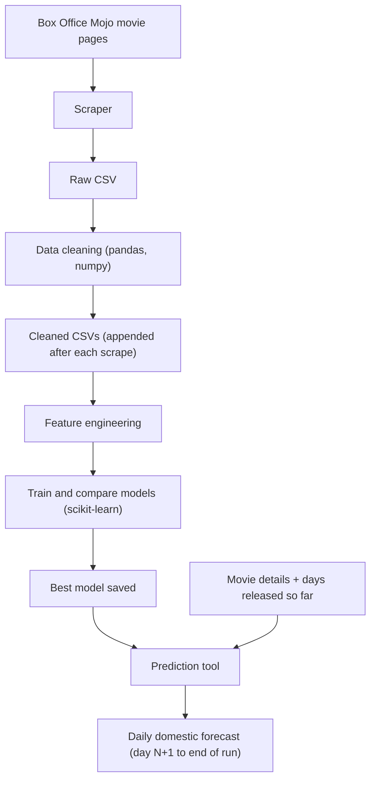

# Movie Box Office Prediction

A Python machine learning project that predicts the **domestic daily box office** of movies, using data scraped from Box Office Mojo.

## Goal

Given a movie, predict its domestic gross day by day:

| Situation | Known inputs | What is predicted |
|---|---|---|
| Movie not released yet | Budget, genre, MPAA rating, runtime, release date, distributor, theater count | Day 1 through the end of the run |
| Movie released N days ago | The above, plus actual daily grosses for days 1 to N | Day N+1 through the end of the run |

## Workflow



## Tech stack

- **Scraping:** Python
- **Cleaning and analysis:** pandas, numpy
- **Modeling:** scikit-learn
- **Storage:** CSV files (raw and cleaned kept separate)

## Data collected

**Per movie (summary section)**

- Title, summary, distributor, release date, MPAA rating, running time, genres
- Domestic, international and worldwide gross
- Opening weekend gross and theaters, widest release
- Production budget (only when listed; otherwise filled in manually if needed)

**Per day (daily table)**

- Date, day of week, rank, daily gross, % change vs. yesterday and last week
- Theaters, per-theater average, gross to date, day number of the run

## Phases

1. **Scraping.** Collect movie links from Box Office Mojo, run the scraper on each movie page, save results to raw CSVs. Use a delay between requests.
2. **Cleaning.** Parse currency, percentages, dates and runtimes into numeric types; handle missing budgets; remove duplicates; sanity-check daily rows (e.g. `To Date` matches the running sum). Write to cleaned CSVs, and append new movies after each scrape.
3. **Feature engineering.**
   - Pre-release: budget, genre, rating, runtime, release month/weekday, holiday window, distributor, theater count, sequel/franchise flag.
   - In-run (for movies already released): days elapsed, previous daily grosses, gross to date, day-of-week, ratio to opening weekend.
4. **Modeling.** Train several scikit-learn models (e.g. Ridge, Random Forest, Gradient Boosting) and compare them against a simple baseline.
5. **Prediction tool.** An input-style script where a movie's details (and its daily grosses so far, if any) are entered and a daily forecast is returned.

## Evaluation

- Split train/test **by time** (train on older movies, test on newer ones), not randomly.
- Compare models against a baseline such as "opening weekend x typical multiplier".
- Report error on daily gross and on the cumulative total (e.g. MAE, MAPE, and RMSLE on log gross), ideally broken down by how many days are already known.

## Planned project structure

```
box-office-prediction/
  data/
    raw/          # scraper output, one CSV per scrape
    cleaned/      # cleaned, accumulating CSVs
  src/
    scraping/
    cleaning/
    features/
    modeling/
    predict/
  models/         # saved trained models
  README.md
```

## Future work

- Actor and director history features
- IMDb and Rotten Tomatoes ratings
- International box office, once better data is available