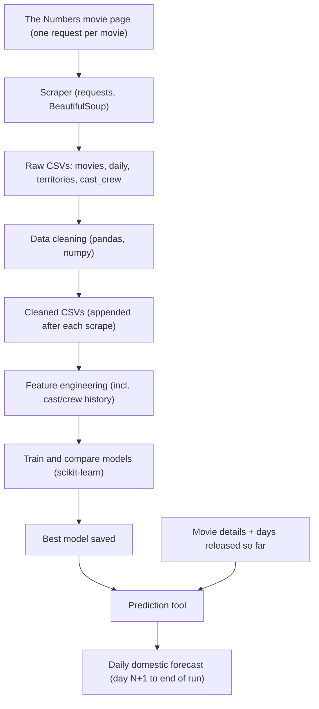

# Movie Box Office Prediction

A Python machine learning project that predicts the **domestic daily box office** of movies, using movie data from [The Numbers](https://www.the-numbers.com). Cast and crew history is used to build extra features, and per-territory international data allows international box office to be added as a second target.

> Data is collected only with written permission from The Numbers (see [Data access and terms](#data-access-and-terms)). The data itself is never published, only the code and results.

## Goal

Given a movie, predict its domestic gross day by day:

| Situation | Known inputs | What is predicted |
|---|---|---|
| Movie not released yet | Budget, genre, MPA rating, runtime, release date, distributor, franchise, planned theater count, cast/crew history | Day 1 through the end of the run |
| Movie released N days ago | The above, plus actual daily grosses for days 1 to N | Day N+1 through the end of the run |

**Secondary goal:** predict international box office from the per-territory data, once the domestic model works.

## Workflow



## Tech stack

- **Scraping:** Python, requests, BeautifulSoup
- **Cleaning and analysis:** pandas, numpy
- **Modeling:** scikit-learn
- **Storage:** CSV files (raw and cleaned kept separate)

## Data collected

Each movie page (e.g. `.../movie/Batman-The-(2021)`) contains the summary, domestic, international and cast sections on one page (the `#summary`, `#domestic`, `#international` and `#cast` links are anchors on the same page). One request per movie is parsed into four linked CSV files.

**Primary key:** `movie_id`, the movie's URL slug (e.g. `Batman-The-(2021)`). Title and release date are stored as normal columns. Ratings and other external data will be joined later by title + year.

| File | One row per | Main contents |
|---|---|---|
| `movies.csv` | movie | Title, release date(s), distributor, MPA rating, runtime, production budget, genre, subgenre, creative type, source material, production method, franchise, opening theaters, max theaters, totals (domestic, international, worldwide) |
| `daily.csv` | movie per day | Date, rank, daily gross, % change vs. yesterday and last week, theaters, per-theater average, gross to date, day number |
| `territories.csv` | movie per country | Territory, release date, opening weekend, opening and max screens, engagements, total box office, report date |
| `cast_crew.csv` | movie per credit | Person (name and person ID if available), role group (leading, supporting, director, screenwriter, producer, executive producer, ...), character or credit |

**Not usable as pre-release features** (only known after the run): opening weekend, legs, opening as % of total, domestic share, inflation-adjusted gross, disc sales, and all totals. These can be used for analysis or as targets, but not as inputs to a pre-release model.

## Phases

1. **Scraping.** Collect movie links, fetch each movie page once, and parse the four sections into raw CSVs. Single connection, delay between requests, and a User-Agent that identifies the bot (required by the site's terms). Append as you go and skip movies already collected.
2. **Cleaning.** Parse currency, percentages, dates and runtimes into numeric types; handle missing budgets; remove duplicates; sanity-check daily rows (e.g. `Total Gross` matches the running sum); decide how to treat Thursday preview rows (rank "P", 0 theaters). Write to cleaned CSVs, and append new movies after each scrape.
3. **Feature engineering.**
   - **Pre-release:** budget, genre, subgenre, creative type, source material, franchise/sequel flag, MPA rating, runtime, release month/weekday, holiday window, distributor, planned theater count.
   - **In-run (for movies already released):** days elapsed, previous daily grosses, gross to date, day-of-week, ratio to opening weekend.
   - **Cast and crew history:** see below.
4. **Modeling.** Train several scikit-learn models (e.g. Ridge, Random Forest, Gradient Boosting) and compare them against a simple baseline.
5. **Prediction tool.** An input-style script where a movie's details (and its daily grosses so far, if any) are entered and a daily forecast is returned.

## Cast and crew features

For each person (leading and supporting actors, director, screenwriters, producers), compute their track record **only from films released before the current film** (sort by release date and use an expanding statistic shifted by one row, so the film being predicted never leaks into its own features):

- Number of previous films (experience)
- Average and total inflation-adjusted domestic gross of previous films
- Average of the last 3 to 5 films, and the best previous film
- `is_debut` flag for people with no history; neutral fill value for missing stats

Then aggregate per film, e.g. mean and max over the leading cast, and the director's and producers' stats, rather than one column per person. Use person IDs/URLs instead of names where available, since names can be shared by different people.

**Coverage caveat:** history only includes films that were scraped, so early movies in the dataset have incomplete histories. Collect systematically (e.g. all wide releases from a given year onward) and consider using the first years only to build histories.

## Evaluation

- Split train/test **by time** (train on older movies, test on newer ones), not randomly.
- Compare models against a baseline such as "opening weekend x typical multiplier".
- Report error on daily gross and on the cumulative total (e.g. MAE, MAPE, and RMSLE on log gross), ideally broken down by how many days are already known.
- **Ablation:** train with and without the cast/crew features to measure how much they help.

## Planned project structure

```
box-office-prediction/
  data/             # local only, in .gitignore
    raw/            # scraper output (movies, daily, territories, cast_crew)
    cleaned/        # cleaned, accumulating CSVs
  src/
    scraping/
    cleaning/
    features/
    modeling/
    predict/
  models/           # saved trained models
  .gitignore
  README.md
```

## Future work

- IMDb and Rotten Tomatoes ratings (joined by title + year)
- International box office model using the per-territory table
- Home video and streaming performance